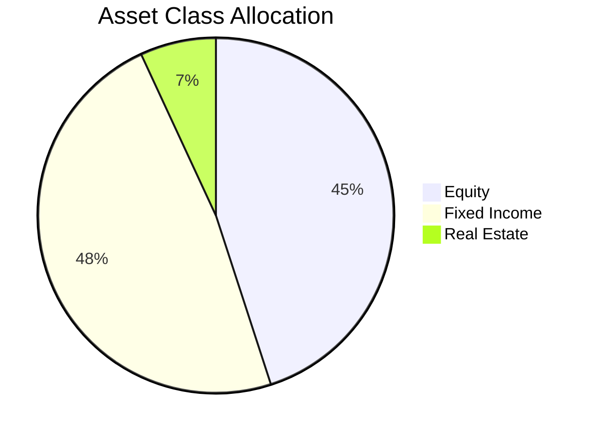

# Investment Report Skill

Generate comprehensive investment portfolio reports by querying the WealthDash API, analyzing the data, and producing structured, actionable output in markdown.

## How This Application Works

WealthDash is a personal portfolio tracker for a **Brazilian investor** with domestic and international exposure. All data lives in a local SQLite database and is exposed via a Fastify REST API.

### Data Model Quick Reference

| Concept | Description |
|---------|-------------|
| **Asset** | A financial instrument (stock, ETF, fund, bond, etc.) |
| **Wallet** | A strategy-based portfolio bucket (e.g. "Renda Variavel", "Inflacao", "Pos-fixado / Caixa") |
| **Transaction** | A BUY record linking an asset to a wallet with quantity, unit price, and date |
| **Position** | Computed: aggregated view of an asset within a wallet (quantity, avg cost, market value, gain) |
| **Portfolio Summary** | Computed: full portfolio with allocation breakdowns and top holdings |

### Asset Types
| Type | Description |
|------|-------------|
| `STOCK` | Brazilian stocks (B3) |
| `ETF` | Exchange-traded funds (US and international) |
| `FII` | Fundos Imobiliarios (Brazilian REITs) |
| `FUND` | Investment funds (mutual funds) |
| `PREVIDENCIA` | Private pension (VGBL/PGBL) |
| `TESOURO` | Tesouro Direto (government bonds) |
| `CDB` | Certificado de Deposito Bancario |
| `LCI` / `LCA` | Tax-exempt credit notes (real estate / agribusiness) |
| `CRI` / `CRA` | Recebiveis (real estate / agribusiness receivables) |

### Asset Classes
- `EQUITY` -- stocks, equity ETFs, multi-market funds
- `FIXED_INCOME` -- bonds, CDBs, LCAs, LCIs, CRIs, CRAs, Tesouro Direto, fixed-income funds
- `REAL_ESTATE` -- FIIs

### Currencies
- `BRL` (Brazilian Real) -- default
- `USD` (US Dollar) -- for international ETFs

### Fixed Income Attributes
- **Rate Type**: `PRE` (pre-fixed), `POST` (post-fixed/floating), `HYBRID` (inflation-linked + spread)
- **Indexer**: `CDI`, `IPCA`, `SELIC`, `NONE`
- **Rate Value**: the spread (e.g. 8.81 means IPCA + 8.81%)
- **Maturity Date**: when the bond matures

---

## API Endpoints for Data Collection

The API runs at `http://localhost:3000`. **Always start the server before querying** if it is not already running.

### Check if server is running
```bash
curl -s http://localhost:3000/api/health || (cd apps/api && npm run dev &)
```

### Essential Endpoints

| Endpoint | Returns |
|----------|---------|
| `GET /api/portfolio/summary` | Full portfolio: totals, allocations by class/type/currency/sector/wallet, top holdings |
| `GET /api/insights/allocation` | Risk insights with severity levels (info, warning, critical) |
| `GET /api/assets` | All registered assets with their attributes |
| `GET /api/assets?asset_type=STOCK` | Filter assets by type (STOCK, ETF, FUND, TESOURO, CDB, etc.) |
| `GET /api/assets?asset_class=EQUITY` | Filter assets by class (EQUITY, FIXED_INCOME, REAL_ESTATE) |
| `GET /api/assets?currency=USD` | Filter assets by currency |
| `GET /api/wallets` | All wallets |
| `GET /api/wallets/:id/positions` | Positions for a specific wallet |
| `GET /api/wallets/:id/transactions` | Transaction history for a wallet |
| `GET /api/settings` | Settings (includes `usd_brl_rate`) |

### Fetching Data

Always use `curl` with `jq` for clean output:
```bash
# Full portfolio summary
curl -s http://localhost:3000/api/portfolio/summary | jq .

# Allocation insights
curl -s http://localhost:3000/api/insights/allocation | jq .

# All assets
curl -s http://localhost:3000/api/assets | jq .

# Positions per wallet (get wallet IDs first)
WALLETS=$(curl -s http://localhost:3000/api/wallets | jq -r '.[].id')
for wid in $WALLETS; do
  echo "=== Wallet: $(curl -s http://localhost:3000/api/wallets/$wid | jq -r '.name') ==="
  curl -s http://localhost:3000/api/wallets/$wid/positions | jq .
done
```

---

## Report Types

When the user asks for a report, determine which type(s) they want and combine as needed. If the request is vague (e.g. "generate a report"), produce a **Complete Portfolio Report** that covers all sections below.

### 1. Portfolio Overview Report

**Purpose**: High-level snapshot of the entire portfolio.

**Data needed**: `GET /api/portfolio/summary`

**Sections to include**:
- **Summary**: total value (R$), total cost, unrealized gain/loss (R$ and %), number of positions
- **Asset Class Allocation**: table with class, value, weight %, cost, gain
- **Currency Exposure**: BRL vs USD split with values and weights
- **Wallet Distribution**: value and weight per strategy bucket
- Highlight if `positions_missing_price > 0` (data quality warning)

**Format example**:
```markdown
## Portfolio Overview -- [DATE]

| Metric | Value |
|--------|-------|
| Total Value | R$ XXX,XXX.XX |
| Total Cost | R$ XXX,XXX.XX |
| Unrealized Gain/Loss | R$ XX,XXX.XX (X.XX%) |
| Positions | XX |
| Missing Prices | X |

### Asset Class Allocation
| Class | Value (R$) | Weight | Cost (R$) | Gain (R$) |
|-------|-----------|--------|----------|----------|
| Equity | ... | XX.X% | ... | ... |
| Fixed Income | ... | XX.X% | ... | ... |
```

### 2. Allocation Deep-Dive Report

**Purpose**: Detailed breakdown of where money is allocated.

**Data needed**: `GET /api/portfolio/summary`

**Sections to include**:
- **By Asset Type**: STOCK, ETF, FUND, TESOURO, CDB, LCA, CRI, CRA, PREVIDENCIA, etc.
- **By Sector**: Oil & Gas, Banking, Technology, Government Bonds, etc.
- **By Currency**: BRL vs USD with observations about international diversification
- **By Wallet/Strategy**: how the portfolio is split across investment strategies
- **Concentration Analysis**: identify the top 3 holdings and their combined weight

### 3. Top Holdings Report

**Purpose**: Detailed view of the largest positions.

**Data needed**: `GET /api/portfolio/summary` (top_holdings field)

**Sections to include**:
- Ranked table of all positions by value, showing: rank, name, ticker, type, value, weight %, gain
- Separate the top 5 with commentary
- Flag any single position > 15% (over-concentration risk)
- Compare the top 10 vs the rest (diversification check)

### 4. Risk & Insights Report

**Purpose**: Risk analysis based on the allocation insights engine.

**Data needed**: `GET /api/insights/allocation`

**Sections to include**:
- **Insights Summary**: count by severity (critical, warning, info)
- **Critical Issues**: list each with title, description, and recommended action
- **Warnings**: list each with title, description, and recommended action
- **Informational**: list each briefly
- **Risk Score**: qualitative assessment (Low / Moderate / Elevated / High) based on insight counts

**Risk score heuristic**:
- 0 critical, 0 warnings = **Low Risk**
- 0 critical, 1-2 warnings = **Moderate Risk**
- 1+ critical OR 3+ warnings = **Elevated Risk**
- 2+ critical = **High Risk**

### 5. Fixed Income Report

**Purpose**: Detailed analysis of the fixed-income portfolio.

**Data needed**: `GET /api/assets?asset_class=FIXED_INCOME`, `GET /api/portfolio/summary`, wallet positions

**Sections to include**:
- **Summary**: total fixed-income value, weight in portfolio, number of instruments
- **By Rate Type**: breakdown into PRE, POST, HYBRID with values and weights within fixed income
- **By Indexer**: CDI vs IPCA vs SELIC vs NONE
- **Maturity Schedule**: group bonds by maturity year, flag upcoming maturities (< 12 months)
- **Credit Risk Distribution**: by asset type (Tesouro = sovereign, CDB = bank, CRI/CRA = corporate)
- **Rate Analysis**: list each instrument with its indexer + spread, sorted by rate_value

### 6. Equity Report

**Purpose**: Analysis of the equity/variable-income portion.

**Data needed**: `GET /api/assets?asset_class=EQUITY`, `GET /api/portfolio/summary`, wallet positions

**Sections to include**:
- **Summary**: total equity value, weight in portfolio, number of positions
- **By Type**: STOCK vs ETF vs FUND split
- **Geographic Exposure**: Brazilian (BRL stocks) vs International (USD ETFs)
- **Sector Distribution**: breakdown by sector within equities
- **Individual Positions**: table with name, ticker, value, weight within equity, gain/loss
- **Performance**: rank positions by gain % (best and worst performers)

### 7. Wallet/Strategy Report

**Purpose**: Analysis of each investment strategy bucket.

**Data needed**: `GET /api/wallets`, `GET /api/wallets/:id/positions` for each wallet

**Sections to include**:
- For each wallet:
  - Name, description, total value, weight in portfolio
  - Positions table: asset name, ticker, type, quantity, avg cost, market value, gain
  - Internal allocation (what types of assets are in this wallet)
- **Cross-wallet comparison**: table comparing all wallets side by side
- **Strategy alignment check**: does each wallet's content match its stated purpose?

### 8. Comparison / Rebalancing Report

**Purpose**: Compare current allocation vs target allocation.

**Data needed**: `GET /api/portfolio/summary` + user-provided target percentages

**Sections to include**:
- **Current vs Target**: table with asset class, current %, target %, deviation
- **Actions Needed**: for each class, calculate R$ amount to buy/sell to reach target
- **Priority Order**: rank actions by absolute deviation (largest first)

**Note**: The application does not store target allocations. Ask the user for their targets, or use common balanced portfolio benchmarks if they don't have specific targets.

---

## Analysis Guidelines

### Formatting Rules
- Always use **R$** for BRL values and **US$** for USD values
- Format large numbers with thousands separators: `R$ 125.430,50` (Brazilian format in commentary, but use standard format in tables for clarity)
- Always include the report date
- Use tables for structured data, prose for analysis and recommendations
- Bold key figures and highlight critical findings
- Sort tables by value (descending) unless another order makes more sense

### Analytical Principles
1. **Always contextualize percentages**: "EQUITY at 45% of portfolio" is more useful than just "45%"
2. **Flag concentration risks**: any single position > 15%, any asset class > 70%, top 3 > 60%
3. **Note missing data**: if positions have no current price, call this out explicitly
4. **Consider currency impact**: USD positions are converted at the stored `usd_brl_rate` -- mention the rate used
5. **Time context**: note that this is a point-in-time snapshot (no historical data available)
6. **Fixed income maturity**: highlight bonds maturing in < 12 months as "short-term liquidity events"
7. **Indexer exposure**: in a high-interest-rate environment, heavy CDI/SELIC exposure is defensive; heavy IPCA is inflation-hedging; heavy PRE is a bet on rate cuts

### Brazilian Market Context
- **CDI/SELIC rate**: the base rate set by COPOM (Banco Central do Brasil). Currently relevant for POST-fixed instruments
- **IPCA**: Brazil's official inflation index. HYBRID instruments (IPCA+spread) protect against inflation
- **Tesouro Direto**: sovereign risk (lowest credit risk in BRL)
- **CRI/CRA**: corporate credit risk, but tax-exempt for individuals (PF)
- **LCI/LCA**: bank credit risk, tax-exempt for individuals (PF)
- **CDB**: bank credit risk, covered by FGC up to R$ 250k per institution
- **FII**: real estate exposure with mandatory dividend distribution (95% of earnings)
- **Previdencia (VGBL/PGBL)**: tax-advantaged retirement, PGBL deductible up to 12% of gross income
- **B3 stocks**: Brazilian exchange, subject to swing trade IR (15%) and day trade IR (20%)
- **International ETFs (via USD)**: subject to exchange rate risk and 15% IR on gains

### What This Skill Does NOT Do
- It does NOT modify any data (no writes, no updates, no deletes)
- It does NOT calculate taxes (IR, IOF, come-cotas) -- only raw gain/loss
- It does NOT provide financial advice -- it produces factual analysis
- It does NOT have historical price data -- all analysis is point-in-time
- It does NOT track dividends, distributions, or coupon payments (not in the data model)

---

## Workflow

1. **Parse the request**: determine which report type(s) the user wants
2. **Check server**: verify the API is reachable (`/api/health`)
3. **Collect data**: fetch all needed endpoints (prefer parallel `curl` calls)
4. **Analyze**: compute derived metrics, identify patterns, flag risks
5. **Format**: produce a clean markdown report with tables, headings, and prose analysis
6. **Save**: write the report as a markdown file to `data/reports/` following the naming and format conventions below
7. **Present**: confirm to the user that the report was saved, show the filename, and summarize the key findings

If the user asks a specific question (e.g. "what's my exposure to inflation-linked bonds?"), skip the full report format and provide a concise, focused answer using the relevant data -- no need to save a file for quick answers.

---

## Report File Storage

Reports are stored as markdown files in the `data/reports/` directory at the project root. The application has a built-in report viewer that reads these files and renders them in the browser.

### File Naming Convention

```
YYYY-MM-DD-slug-describing-report.md
```

- **Date prefix** (`YYYY-MM-DD`): the date the report was generated. This ensures reports are naturally sorted chronologically in the filesystem.
- **Slug**: a short kebab-case descriptor of the report content (e.g. `portfolio-overview`, `fixed-income-analysis`, `allocation-deep-dive`, `risk-report`).
- **Extension**: always `.md`

**Examples**:
```
2026-03-02-portfolio-overview.md
2026-03-02-fixed-income-maturity-analysis.md
2026-02-15-equity-performance-report.md
2026-01-31-rebalancing-review.md
```

### Frontmatter (Required)

Every report file MUST start with YAML frontmatter containing at least a `title` field:

```markdown
---
title: Portfolio Overview Report
---
```

The `title` is displayed in the application's report list sidebar. Make it descriptive and human-readable.

### Markdown Format Requirements

Reports must be well-structured markdown documents following these rules:

1. **Do NOT include an H1 (`#`)** in the body -- the application renders the frontmatter `title` as the page heading.

2. **Use H2 (`##`) as the top-level section heading** within the report body.

3. **Tables**: use GFM (GitHub Flavored Markdown) pipe tables for all structured data. Always include alignment:
   ```markdown
   | Metric | Value | Weight |
   |--------|------:|-------:|
   | Equity | R$ 150,000.00 | 45.2% |
   ```

4. **Diagrams**: when the report benefits from visual representation of flows, structures, or relationships, include Mermaid diagrams using fenced code blocks:
   ````markdown
   ```mermaid
   pie title Asset Class Allocation
       "Equity" : 45.2
       "Fixed Income" : 48.1
       "Real Estate" : 6.7
   ```
   ````

   Useful diagram types for investment reports:
   - `pie` -- allocation breakdowns (asset class, sector, currency)
   - `xychart-beta` -- bar charts for top holdings, performance comparisons
   - `flowchart` -- decision trees for rebalancing actions
   - `timeline` -- maturity schedules for fixed income

5. **Key metrics in bold**: highlight important numbers with `**bold**`.

6. **Date in content**: always include the generation date prominently (e.g. as a subtitle or in the first paragraph).

7. **Currency formatting**: use `R$` for BRL and `US$` for USD. Use dots for thousands separators and comma for decimals in running text (Brazilian format: `R$ 125.430,50`). In tables, use standard format for alignment.

### Full Report Template

```markdown
---
title: Portfolio Overview Report
---

## Summary

Report generated on **02/03/2026**.

| Metric | Value |
|--------|------:|
| Total Value | R$ 500.000,00 |
| Total Cost | R$ 420.000,00 |
| Unrealized Gain | R$ 80.000,00 (19,05%) |
| Positions | 25 |

## Asset Class Allocation

| Class | Value (R$) | Weight | Gain (R$) |
|-------|----------:|-------:|----------:|
| Equity | 225.000,00 | 45,0% | 35.000,00 |
| Fixed Income | 240.500,00 | 48,1% | 40.000,00 |
| Real Estate | 34.500,00 | 6,9% | 5.000,00 |



## Top Holdings

| # | Asset | Type | Value (R$) | Weight | Gain |
|---|-------|------|----------:|-------:|-----:|
| 1 | PRIO3 | STOCK | 45.000,00 | 9,0% | +22,5% |
| 2 | Tesouro IPCA+ 2029 | TESOURO | 38.000,00 | 7,6% | +8,1% |

## Risk Insights

> **1 critical issue, 2 warnings detected.**

### Critical: Single Asset Dominance
PRIO3 represents 9.0% of the portfolio...

### Warning: Currency Concentration
95.2% of the portfolio is in BRL...

## Recommendations

1. Consider increasing international diversification...
2. Review the concentration in Oil & Gas sector...
```

### Writing the File

Use the Write tool to save the report:

```
Write file to: data/reports/YYYY-MM-DD-slug.md
```

Or use bash:
```bash
cat > data/reports/2026-03-02-portfolio-overview.md << 'REPORT'
---
title: Portfolio Overview Report
---

## Summary
...
REPORT
```

**Important**: always verify the `data/reports/` directory exists before writing. If it doesn't, create it:
```bash
mkdir -p data/reports
```
